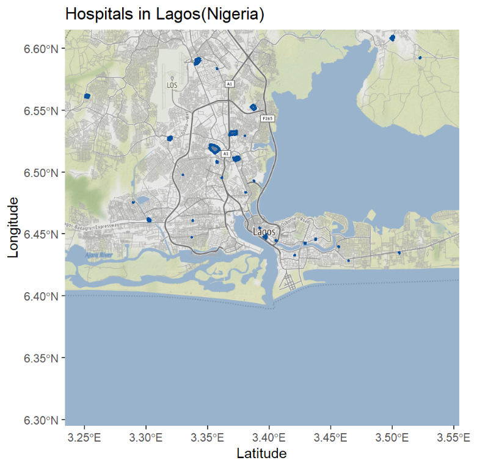
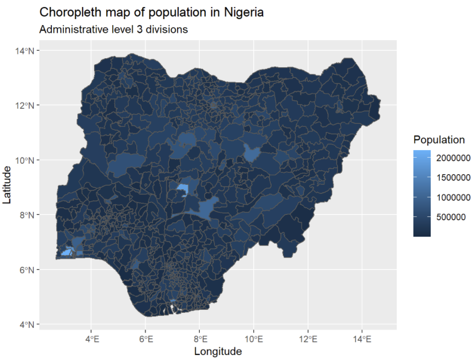
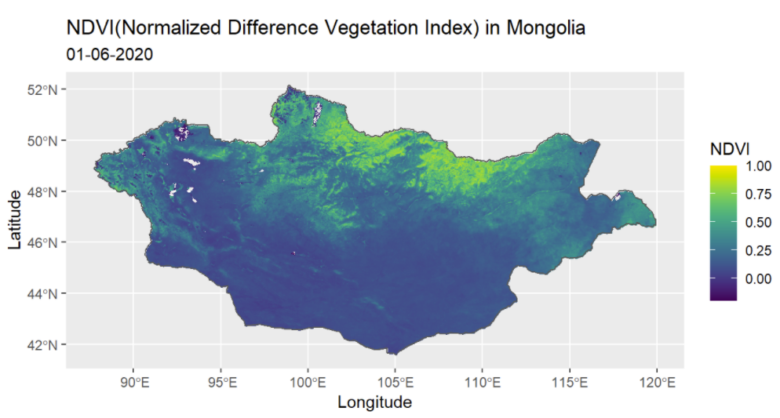

# rspatialdata

### rspatialdata is a collection of data sources and tutorials on visualising spatial data using R

### [https://rspatialdata.github.io/](https://rspatialdata.github.io/)

Tutorials are available on the following spatial properties

- Administrative boundaries
- Open Street Map data
- Population
- Elevation
- Temperature
- Rainfall
- Humidity
- Vegetation
- Land Cover
- DHS
- Malaria
- Air Pollution
- Species Occurrence

